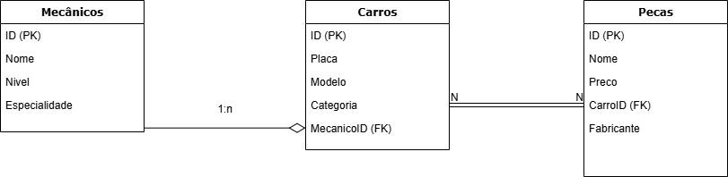

# [ES-11] Ponderada de Matemática semana 4

## Descrição

Este projeto apresenta uma análise aprofundada de modelagem de dados focando em relações 1:N e N:N em um sistema de oficina mecânica.

## Estrutura do Projeto

- `oficina.sql`: Contém as definições das tabelas e consultas SQL
- `README.md`: Documentação do projeto

## Modelo de Dados

### Diagrama de Relacionamento



## Tabelas

### Mecanicos

| Campo | Tipo | Descrição |
|-------|------|-----------|
| ID | INT | Identificador único do mecânico |
| Nome | VARCHAR(100) | Nome do mecânico |
| Nivel | VARCHAR(50) | Nível de experiência do mecânico |
| Especialidade | VARCHAR(100) | Especialidade do mecânico |

### Carros


| Campo | Tipo | Descrição |
|-------|------|-----------|
| ID | INT | Identificador único do carro |
| Placa | VARCHAR(20) | Placa do carro |
| Modelo | VARCHAR(100) | Modelo do carro |
| Categoria | VARCHAR(50) | Categoria do carro |    

### Pecas

| Campo | Tipo | Descrição |
|-------|------|-----------|
| ID | INT | Identificador único da peça |
| Nome | VARCHAR(100) | Nome da peça |
| Preco | DECIMAL(10,2) | Preço da peça |
| Fabricante | VARCHAR(100) | Fabricante da peça |

### CarrosPecas

| Campo | Tipo | Descrição |    
|-------|------|-----------|
| CarroID | INT | Identificador único do carro |
| PecaID | INT | Identificador único da peça |

## Consultas SQL    

1. Demonstrando relação 1:N (Mecânicos -> Carros): Selecionar mecânicos e os carros que eles consertam:

```sql
SELECT m.Nome, m.Nivel, c.Modelo, c.Placa
FROM Mecanicos m
JOIN Carros c ON m.ID = c.MecanicoID
WHERE m.Especialidade = 'Motor';
```

**Álgebra Relacional:**
```
π Nome, Nivel, Modelo, Placa (σ Especialidade='Motor' (Mecanicos ⨝ Carros))
```

2. Demonstrando relação N:N (Carros <-> Peças): Selecionar carros e suas respectivas peças:    

```sql
SELECT c.Modelo, c.Placa, p.Nome as NomePeca, p.Fabricante
FROM Carros c
JOIN CarrosPecas cp ON c.ID = cp.CarroID
JOIN Pecas p ON cp.PecaID = p.ID
WHERE p.Preco > 100;
``` 

**Álgebra Relacional:**
```
π Modelo, Placa, Nome, Fabricante (σ Preco>100 (Carros ⨝ CarrosPecas ⨝ Pecas))
```

3. Combinando relações 1:N e N:N: Selecionar mecânicos, seus carros e as peças utilizadas:

```sql
SELECT m.Nome as Mecanico, c.Modelo, p.Nome as Peca
FROM Mecanicos m
JOIN Carros c ON m.ID = c.MecanicoID
JOIN CarrosPecas cp ON c.ID = cp.CarroID
JOIN Pecas p ON cp.PecaID = p.ID
WHERE m.Nivel = 'Senior';
```

**Álgebra Relacional:**
```
π Nome, Modelo, Peca (σ Nivel='Senior' (Mecanicos ⨝ Carros ⨝ CarrosPecas ⨝ Pecas))
```

## Explicação dos Operadores

- σ (sigma): Operador de Seleção (WHERE)
- π (pi): Operador de Projeção (SELECT)
- ⨝ (join): Operador de Junção Natural (JOIN)

Cada equação representa:
1. Projeta atributos após junção 1:N entre Mecanicos e Carros
2. Projeta atributos após junção N:N entre Carros e Pecas através da tabela CarrosPecas
3. Projeta atributos após combinar todas as relações (1:N e N:N)


